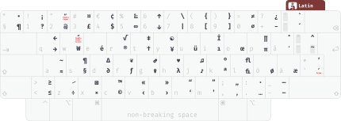
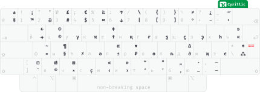

# Latin and Cyrillic keyboard layouts for macOS

A small macOS keyboard layout bundle with custom Latin and Cyrillic input sources.

## Preview

## Installation

1. Copy the `.bundle` file from the archive to `/Library/Keyboard Layouts`.
2. Restart your Mac, or log out and back in.
3. Go to **System Settings** → **Keyboard** → **Text Input** → **Input Sources** → **Edit…**
4. Click **+** and enable:
   - **Swedish** → **Latin**
   - **Bashkir** → **Cyrillic**
